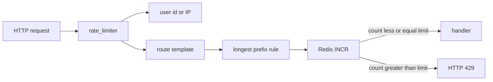

# Rate Limit Guide

This boilerplate limits how often a caller may hit a route. Rules live in **PostgreSQL** (per user **tier**). Counters live in **Redis** (fixed time window). Enforcement is an opt-in FastAPI dependency — not a global middleware.

It is applied on **login** and **refresh** (anonymous callers, keyed by IP), blog **tags**, and the **GET** task routes (`processed`, `pending`, `queue-health`, `/{task_id}`). Other endpoints stay unlimited until you add `Depends(rate_limiter)` yourself. Do not put the limiter on `/health` or `/ready`.

Related code: `backend/src/apps/system/rate_limits/`, `backend/src/core/utils/rate_limit.py`. Deploy modes: [Deployment Guide](deploy-guide.md).

---

## How a request is limited



Step by step:

1. The route must list `Depends(rate_limiter)`. If it does not, nothing is counted.
2. **Who is calling?**
   - Logged in: the Redis key uses `user.id`.
   - Anonymous: the key uses an IP from `caller_identifier` (see [TRUST_PROXY_HEADERS](#trust_proxy_headers-anonymous-callers-and-reverse-proxies)).
   - Anonymous with no IP at all: the limiter **skips** the request (it does not bucket everyone as `"Unknown"`).
3. **Which route?** The identity is the FastAPI **template**, including `/api` + `/v1`, with path parameters kept as `{param}`.  
   URL `/api/v1/system/tasks/a1b2-uuid` → template `/api/v1/system/tasks/{task_id}`.  
   One bucket per endpoint, not one bucket per UUID.
4. **Which rule?** Authenticated users load all `system_rate_limit` rows for their **tier**. Matching is **longest-prefix** on the sanitized path (slashes become underscores):
   - `/api/v1/system/tasks` → `api_v1_system_tasks`
   - `/api/v1/system/tasks/queue-health` → `api_v1_system_tasks_queue-health`  
     A rule on `/api/v1/system/tasks` covers `queue-health`, `processed`, and `{task_id}`. A more specific rule wins.
5. **Count.** Redis key: `ratelimit:{user_or_ip}:{path}:{window}`. `INCR` and `EXPIRE … NX` run in one pipeline (fixed window of `period` seconds). If no tier rule matched, `DEFAULT_RATE_LIMIT_LIMIT` and `DEFAULT_RATE_LIMIT_PERIOD` apply, and the key uses the **template** (still not the UUID).
6. If the count is **greater than** `limit`, the API returns **HTTP 429** (`Rate limit exceeded.`). `limit=0` means “block this path”. `period` must be at least `1` second.

---

## Configuring rules (superuser API)

CRUD is under `/api/v1/system/rate-limits/...` and requires a superuser. Paths you send are sanitized before storage (`/api/v1/system/tasks` is stored as `api_v1_system_tasks`). The path must match a real mounted route or a prefix of one (otherwise **422**). Names and paths are unique **per tier**, not globally.

Example: at most one request per hour to anything under tasks, for the default tier:

```http
POST /api/v1/system/rate-limits/tier/{tier_id}
Content-Type: application/json

{
  "name": "tasks-group",
  "path": "/api/v1/system/tasks",
  "limit": 1,
  "period": 3600
}
```

A second `GET /api/v1/system/tasks/queue-health` in that window returns 429.

---

## Applying the limiter to another route

Copy the pattern from `backend/src/apps/system/tasks/routers/v1.py`. Put it on `dependencies=` of the decorator if the handler does not use a return value from the limiter:

```python
from fastapi import Depends
from src.apps.system.rate_limits.deps import rate_limiter

@router.get(
    "/example/items",
    dependencies=[Depends(rate_limiter)],
)
async def read_items(...):
    ...
```

Authenticated users keep using `user.id`. **Anonymous** routes are when `TRUST_PROXY_HEADERS` matters: every guest is keyed by IP.

Do not add the dependency to every route unless you intend to. The sample stays on task GETs on purpose.

---

## Defaults and Redis

| Variable                    | Code default                  | Role                                                     |
| --------------------------- | ----------------------------- | -------------------------------------------------------- |
| `DEFAULT_RATE_LIMIT_LIMIT`  | `10`                          | Requests allowed in the window when no tier rule matches |
| `DEFAULT_RATE_LIMIT_PERIOD` | `3600`                        | Window length in seconds                                 |
| `REDIS_RATE_LIMIT_*`        | falls back toward cache Redis | Redis used for counters                                  |

`backend/.env.example` sets `DEFAULT_RATE_LIMIT_LIMIT=4` and `DEFAULT_RATE_LIMIT_PERIOD=1` for a short local window. Copy those if you want the same locally.

---

## TRUST_PROXY_HEADERS: anonymous callers and reverse proxies

This section is only about **anonymous** rate limits (no JWT). Logged-in callers are identified by user id regardless of this flag.

### The problem (what FastAPI “sees” as an IP)

Uvicorn’s `request.client.host` is the **TCP peer**: whoever opened the socket to port 8000.

- Browser talks **directly** to Uvicorn → that host is the user’s IP. Correct.
- Browser talks to **Caddy / Nginx / Dokploy**, and the proxy talks to Uvicorn → that host is **always the proxy**. Every guest shares one IP. One heavy client can exhaust the bucket for the whole internet, or a swarm of bots can hide behind a single counted address.

```
  User 203.0.113.10                User 198.51.100.20
           \                              /
            \                            /
             v                          v
        ┌─────────────────────────────────────┐
        │  Reverse proxy (Caddy, Nginx,        │
        │  Dokploy, Coolify, cloud load        │
        │  balancer)                           │
        └─────────────────┬───────────────────┘
                          │ TCP from 10.0.0.8 (proxy)
                          v
                   FastAPI :8000
                   request.client.host == 10.0.0.8
```

The proxy also sends headers such as:

```
X-Forwarded-For: 203.0.113.10, 10.0.0.8
```

Left-to-right, the **first** hop is the original client (when you trust the proxy). `X-Real-IP` is a single-IP variant some Nginx setups use.

With `TRUST_PROXY_HEADERS=True`, this project’s limiter uses that **first** `X-Forwarded-For` hop, or `X-Real-IP`, instead of the proxy’s address.

### Why the default is False

`TRUST_PROXY_HEADERS` is **not** listed in `backend/.env.example`. In code (`src/core/config.py`) it defaults to `False`. If the variable is missing from `.env`, headers are **ignored**.

That is intentional. Anyone on the internet can send:

```
X-Forwarded-For: 1.2.3.4
```

If the API is reachable **without** a proxy, trusting that header lets an attacker rotate fake IPs and slip past anonymous limits.

**Rule of thumb:** is there something between the public internet and Uvicorn? Yes → `True`. No → leave it unset / `False`.

### How to turn it True

**1. Deploy Compose (you do not need a line in `.env`)**

The `api` service already injects the variable. Compose `environment` overrides `env_file` for that key.

- [deploy/compose/full-stack/docker-compose.yml](../deploy/compose/full-stack/docker-compose.yml) — Caddy in front of the API.
- [deploy/compose/app-only/docker-compose.yml](../deploy/compose/app-only/docker-compose.yml) — platform ingress (Dokploy, Coolify, Nginx, PaaS).

App-only comments this explicitly:

```yaml
environment:
  # Platform / ingress proxy (Dokploy, Coolify, nginx, …). Override to False
  # only if the API is reached without a reverse proxy.
  TRUST_PROXY_HEADERS: "True"
```

That file **exposes** port 8000 on the Docker network (`expose: "8000"`) and does **not** publish it on the host. Browsers never talk to Uvicorn. Only the platform proxy does. Trusting forwarded headers is then both necessary and safe.

Omitting the variable from `.env` does **not** turn it off here. To force `False` on that Compose file, change the service `environment` block itself.

**2. Native / `poetry run uvicorn` / Gunicorn without those Compose files**

Add the line yourself to `backend/.env` (it is not in `.env.example`):

```bash
TRUST_PROXY_HEADERS=True
```

Only do this when a reverse proxy (native Nginx, Caddy elsewhere, a load balancer) sits in front of the app. Direct local Uvicorn: do not add it.

### What each proxy does

**Caddy** (compose full-stack): the [Caddyfile](../deploy/compose/full-stack/Caddyfile) is `reverse_proxy api:8000`. Caddy terminates HTTP/HTTPS and adds `X-Forwarded-For` (and related headers) on the way to the API. The Compose file sets `TRUST_PROXY_HEADERS: "True"` for that reason.

**Nginx** (native): [deploy/native/nginx/nginx.conf](../deploy/native/nginx/nginx.conf) already has:

```nginx
proxy_set_header X-Forwarded-For $proxy_add_x_forwarded_for;
proxy_set_header X-Real-IP $remote_addr;
```

Compose is not in the picture, so you **must** add `TRUST_PROXY_HEADERS=True` to `backend/.env`. Otherwise the limiter still sees Nginx’s address as every guest.

**Dokploy / Coolify / CapRover / typical PaaS:** the platform runs Traefik, Caddy, or a cloud load balancer as the only public HTTP entry. You deploy app-only Compose onto their network. That is the situation lines 47–48 describe: ingress in front, API not published. Leave the Compose `True`; no `.env` line required.

### Mode cheat sheet

| How you run the API                                | `TRUST_PROXY_HEADERS`           | Why                                              |
| -------------------------------------------------- | ------------------------------- | ------------------------------------------------ |
| `poetry run uvicorn` on your machine               | unset → **False**               | Browser talks to Uvicorn                         |
| Development Compose (`ports: 8000:8000`, no Caddy) | unset → **False**               | Dev Compose does not inject the flag             |
| Deploy Compose full-stack                          | **True** in Compose             | Caddy is in front; no `.env` line                |
| Deploy Compose app-only                            | **True** in Compose             | Dokploy / Coolify / PaaS ingress; no `.env` line |
| Native Nginx + Gunicorn                            | **True** in `.env` (you add it) | Nginx already forwards the headers               |

### Two different switches (do not mix them up)

Deploy Compose also starts Uvicorn with `--proxy-headers --forwarded-allow-ips=*`. That is **Uvicorn/Starlette**: scheme, `Host`, and sometimes `request.client` from forwarded headers. Docker NAT IPs are not stable, hence `*`.

`TRUST_PROXY_HEADERS` is **only this project's rate limiter**. It reads the first `X-Forwarded-For` hop (then `X-Real-IP`) for **anonymous** Redis keys. Turning one on does not replace the other.

---

## Related files

| Path                                           | Role                                                             |
| ---------------------------------------------- | ---------------------------------------------------------------- |
| `backend/src/apps/system/rate_limits/deps.py`  | `rate_limiter`                                                   |
| `backend/src/core/utils/rate_limit.py`         | Template, longest-prefix, Redis, `caller_identifier`             |
| `backend/src/core/config.py`                   | `TRUST_PROXY_HEADERS` default `False`                            |
| `backend/src/apps/system/tasks/routers/v1.py`  | Sample `Depends(rate_limiter)`                                   |
| `deploy/compose/app-only/docker-compose.yml`   | Forces `True` behind platform ingress                            |
| `deploy/compose/full-stack/docker-compose.yml` | Forces `True` behind Caddy                                       |
| `deploy/native/nginx/nginx.conf`               | Sets `X-Forwarded-For` / `X-Real-IP` (you still set the env var) |

---

[Back to backend README](../backend/README.md)
